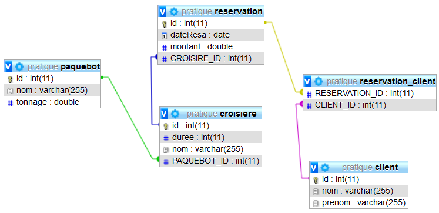
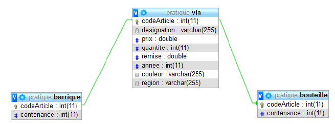

# Découverte de SpringBoot : Solutions (session 3)

## Springdemo01 (Standalone)

Afficher un message dans la console avec Spring.

## Springdemo02 (Web)

Afficher un message dans un navigateur avec Spring.

## Springdemo03 (Web & RestController)

Afficher une liste d'objets au format JSON dans un navigateur avec Spring.

## Springdemo04 (JDBC - DAO - CRUD - JdbcTemplate)

Cette version démo utilise encore des requêtes SQL à l'aide de JdbcTemplate. ça permet de réviser le SQL pour le CRUD !

Accéder à la table Pilote dans la base de données bd-avion et exécuter les tâches suivantes (toujours dans la console) :

- Lister tous les pilotes
- Rechercher un pilote par nom comme "Elodie"
- Ajouter 2 nouveaux Pilotes
- Modifier le site d'un Pilote
- Supprimer le dernier Pilote

Il y a 2 versions de la méthode pour ajouter un pilote :

- Version non commentée en supposant que la clef primaire `PI_ID` de la table pilote est **auto-générée**
- Version commentée à utiliser si votre clef primaire `PI_ID`n'est pas auto-générée (Atttention, dans ce cas la méthode ne doit pas retourner un int !)  

## Spring-hibernate (Web - RestController - JPA - Hibernate)

Dans cet exemple, vous avez 2 classes **@Entity** : 

- Apprenant
- Region

Vous pouvez lister tous les apprenants ou toutes les régions au format JSON dans un navigateur.

Vous pouvez rechercher un apprenant par son **id**

Cette exemple permet de découvrir comment simplifier l'accès à la base de données grâce aux annotations.

## Spring pratique01 (Web - Spring - HTML - JSON - AJAX)

Autre démo basique

## Spring pratique02 (Web - JSON - JPA - Hibernate - SpringBoot)

Cet exemple permet de comprendre le lien entre un Front JS et un Back SpringBoot associé à JPA/Hibernate.

Il faut juste créer une base de données **pratique3** et modifier le fichier **applications.properties**.

## Mapping avec JPA/Hibernate et SpringBoot - (Session4)

### 1 - ENTITE VIN - PERSISTANCE **pinard01** avec  identifiant *NON AUTO-GENERE*

### 2 - ENTITE VIN AVEC **CLE PRIMAIRE AUTO-GENEREE** **pinard02**

### 3 - ENTITE VIN : CLE PRIMAIRE COMPOSITE avec **@IdClass** <!--([**pinard03]<(exercices/pinard03-entity-clef-composee-IdClass.md)**)-->

### 4 - ENTITE VIN : CLE PRIMAIRE COMPOSITE avec **EmbeddedId** <!--(**[pinard04](exercices/pinard04-entity-clef-composee-EmbeddedId.md.md)**)-->

### 5 - ENTITE CLIENT : MAPPING MULTI-TABLES avec **@SecondaryTable** **client01**

### 6 - **@OneToOne** : ASSOCIATION UNIDIRECTIONNELLE DE 1 VERS 1 **client02**

### 7 - **@OneToOne** : ASSOCIATION BIDIRECTIONNELLE DE 1 VERS 1 **client03**

### 8 - **@OneToOne** & **@OneToMany** : ASSOCIATION UNIRECTIONNELLE DE 1 VERS n **client04**

### 9 - **@ManyToOne** : ASSOCIATION UNIDIRECTIONNELLE DE N VERS 1 **croisiere01**

### 10 - **@ManyToMany**, **@OneToMany** : ASSOCIATION BIDIRECTIONNELLE DE N VERS 1 **croisiere02**

### 11 - **@ManyToMany**, **@OneToMany**, **@ManyToOne** : ASSOCIATION BIDIRECTIONNELLE DE N VERS N **croisiere03**

### 12.1 - HERITAGE : **SINGLE_TABLE** - UNE TABLE UNIQUE PAR HIERARCHIE/CLASSE **springheritage01**

### 12.2 - HERITAGE : **TABLE_PER_CLASS** - UNE TABLE PAR CLASSE CONCRETE **springheritage02**

### 12.3 - HERITAGE : **JOINED** - UNE TABLE PAR SOUS-CLASSE **springheritage03**

L'annoation **JOINED** permet de générer des jointures.

### 12.4 – HERITAGE : **@MappedSuperClass** - CLASSE DE BASE NON PERSISTANTE **springheritage04**

L'annoation **@MappedSuperClass** permet de générer des tables relatives au sous-classes en intégrant les propriété de la classe mère.